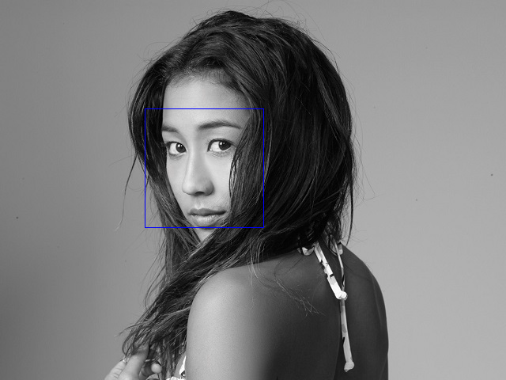

# [libfacedetection](https://github.com/ShiqiYu/libfacedetection) binding for Go

- https://godoc.org/github.com/chai2010/libfacedetection-go
- https://github.com/ShiqiYu/libfacedetection

## Example ([hello.go](hello.go))

```go
package main

import (
	"github.com/chai2010/libfacedetection-go"
)

func main() {
	m := GetImage("./libfacedetection/images/keliamoniz2.jpg")
	rgb, w, h := libfacedetection.NewRGBImageFrom(m)

	faces := libfacedetection.DetectFaceRGB(rgb, w, h, w*3)
	fmt.Printf("%#v\n", faces)
}

// output:
// []libfacedetection.Face{
//     libfacedetection.Face{X:183, Y:137, W:150, H:150, Neighbors:94, Angle:0}
// }
```


